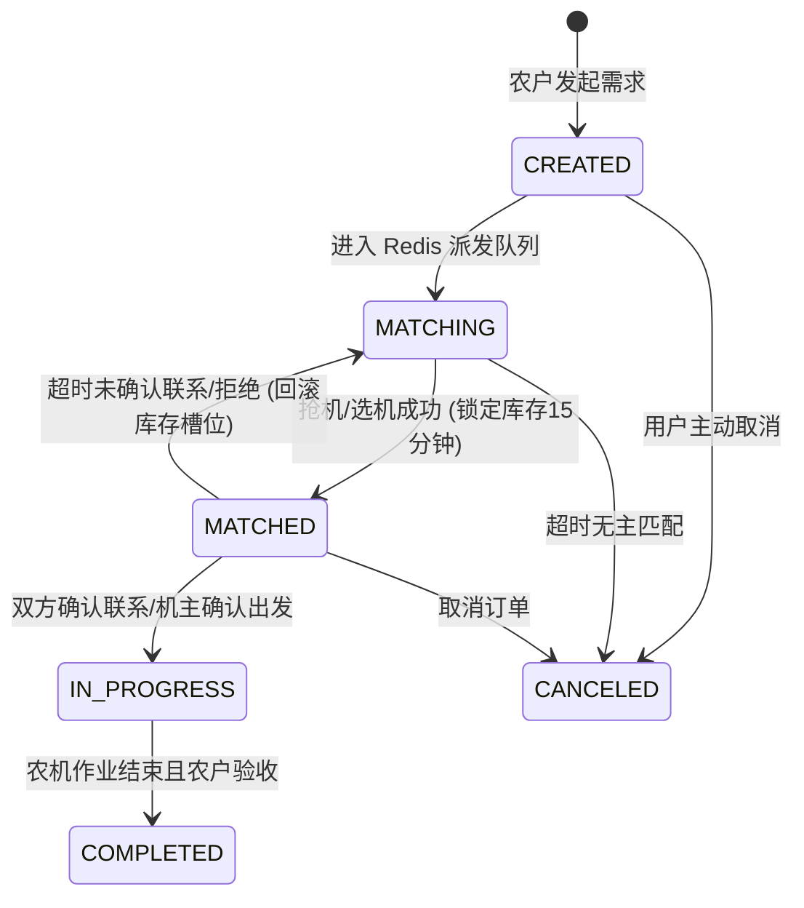

# 农助手：高可用订单状态机与并发防踩踏设计

> **由 AI 数据库/算法架构专家编撰**

为保障农机系统（特别在春耕、秋收高并发期间）的核心联系与服务状态一致性，采用基于 `version` 乐观锁机制构建严格的正向与逆向流转状态机。平台只负责撮合、联系确认与进度留痕，不参与资金结算。

## 1. 状态演进拓扑 (State Topology)



## 2. 状态扭转乐观锁规范 (Optimistic Locking)

任何引起 `order_info` 和 `demand` 状态转换的操作，**必须**遵循乐观锁协议，严禁直接使用全量 `UPDATE` 单盲写。

### 2.1 Java / MyBatis 编写范式

核心 SQL 在做状态更新时务必前置 `Old Status` 和 `Version`：

```sql
UPDATE order_info 
SET 
    status = #{newStatus}, 
    version = version + 1 
WHERE 
    id = #{orderId} 
    AND status = #{expectOldStatus}
    AND version = #{currentVersion};
```

**应用层兜底：**
- **重试机制：** 修改受影响行数 (`affectedRows`) 如果为 0，程序中应抛出定制的 `ConcurrentModificationException`。外层应用可接入 `Cockatiel` 等库利用回退抖动重试 (Exponential Backoff)。
- **降级容灾：** 如果 Redis 在执行 `lock_slot` 和 `geo_dispatch` 时大面积脱机。抢机核心方法将脱离 Redis 判定，退化成直接靠如上的 MySQL 更新占位机制抵御超卖并发。

## 3. 并发热点应对方案

1. **缓存时效对齐**
   - 处于 `MATCHED` 阶段（已锁定联系窗口但未完成双方确认），Redis 中将保存15分钟限时特征 `SETEX user_lock 900`。
   - 若期限结束尚未演进至 `IN_PROGRESS`，依靠 RabbitMQ 延迟队列（或者 Redisson 信号机制）异步下发 `UNLOCK` 指令到 Redis 归还占用位，并走 Database 乐观锁退回至 `MATCHING`。
   
2. **读写分离与前置屏障**
   - 列表、地理位置轮询大量走 `V15__index_optimization` 涉及的联合覆盖索引。
   - 写操作必须经过状态机核心引擎，限制越级跳跃（例如不能直接从 CREATED 跃迁到 COMPLETED）。
